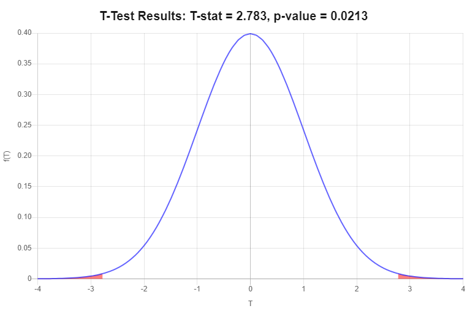
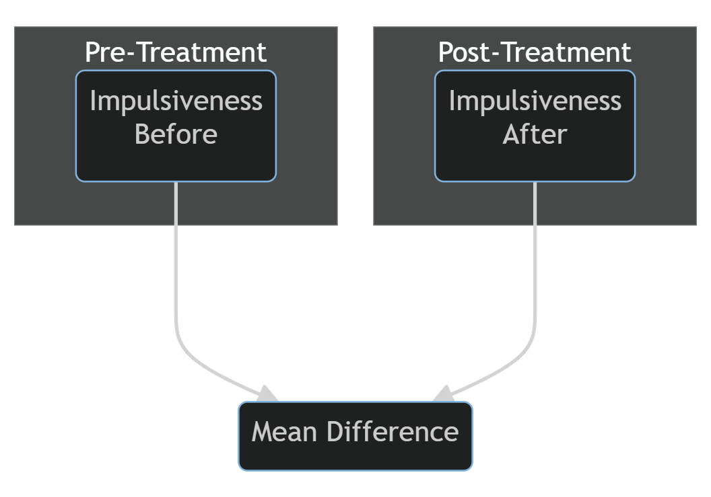
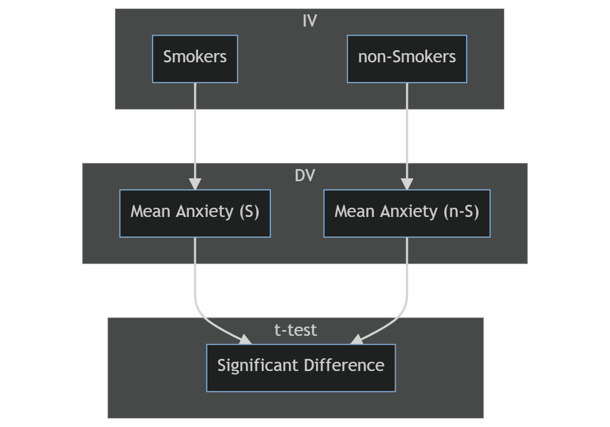

```{r setup, include=FALSE}
knitr::opts_chunk$set(echo = TRUE)
library(jmv)
library(kableExtra)
```

**3 main types:**

-   One Sample: compares a single sample mean to a known population mean
-   Matched Samples: Compares changes in a sample mean across time
-   Independent Samples: Compares two different sample means

### Overview of the t-test

-   Used for comparing the means of continuous (measurement) data (IQ, height, exam results)
-   Differences between sample means
-   Estimates the Standard Error (difference we expect to see by chance) using sample statistics
-   t-statistic is a ratio of the mean differences obtained and the mean differences expected by chance

$$
  t = \frac{obtained\ mean\ difference}{std\ diff\ expected\ by\ chance}
$$

### Standard Error

-   The extent to which sample means deviate from the population mean
-   The difference between the population mean and the sample mean we should expect by chance.

Standard error is estimated using the *Central Limit Theorem*:

$$
  = \frac{\sigma}{\sqrt{n}} = \frac{pop'n\ sd}{\sqrt{sample\ size}}
$$

### Comparing the sample mean to population mean

$$
  z = \frac{\bar{X} - \mu}{\frac{\sigma}{\sqrt{n}}}
$$

*This theorem confirms that the larger the sample size, the lower the error*

### One Sample t-test {.well}

Compares a single sample mean to a population mean (when we do not know $\sigma$)

#### Example

-   'Impulsiveness' questionnaire (continuous scale from 0 - 18)
-   $\mu = 7.01$
-   Sample of 10 drug users ($n = 10$)
-   Higher levels of impulsiveness is expected in drug users compared to the rest of the population.

#### Hypotheses

\begin{align}
  H_0: \mu = 7.01 \\
  H_a: \mu \ne 7.01 \\
\end{align}

#### Sample Data

<table class="table table-hover">
    <thead>
        <tr scope="row">
            <th scope="col">$X$</th>
            <th scope="col">$X-\bar{X}$</th>
            <th scope="col">$(X-\bar{X})^2$</th>
        </tr>
    </thead>
    <tbody>
        <tr scope="row">
            <td>8.5</td>
            <td>-1.37</td>
            <td>1.88</td>
        </tr>
        <tr scope="row">
            <td>12.1</td>
            <td>2.23</td>
            <td>4.97</td>
        </tr>
        <tr scope="row">
            <td>10</td>
            <td>0.13</td>
            <td>0.02</td>
        </tr>
        <tr scope="row">
            <td>5.2</td>
            <td>-4.67</td>
            <td>21.81</td>
        </tr>
        <tr scope="row">
            <td>15.3</td>
            <td>5.43</td>
            <td>29.48</td>
        </tr>
        <tr scope="row">
            <td>6.2</td>
            <td>-3.67</td>
            <td>13.47</td>
        </tr>
        <tr scope="row">
            <td>9.1</td>
            <td>-0.77</td>
            <td>0.59</td>
        </tr>
        <tr scope="row">
            <td>10.2</td>
            <td>0.33</td>
            <td>0.11</td>
        </tr>
        <tr scope="row">
            <td>7.9</td>
            <td>-1.97</td>
            <td>3.88</td>
        </tr>
        <tr scope="row">
            <td>14.2</td>
            <td>4.33</td>
            <td>18.75</td>
        </tr>
    </tbody>
</table>

\begin{align}
  \bar{X} = ???
  s &= \sqrt{\frac{\Sigma(X-\bar{X})^2}{n-1}} = \sqrt{\frac{95}{9}} = 3.25 \\
  t &= \frac{\bar{X} - \mu}{\frac{s}{\sqrt{n}}} = \frac{9.87 - 7.01}{\frac{3.25}{\sqrt{10}}} = \frac{2.86}{1.03} \\
  &= 2.78(df = 9)
\end{align}

#### Decision Making

-   Calculated t-value = 2.78
-   Critical (from table) t-value = 2.262
-   Since the calculated t-value is greater than the <abbr title="from a table">critical</abbr> t-value, we can reject the null hypothesis. The drug users in this sample showed significantly higher levels of impulsivity than the general population.


{width=50%}

>#### **Reporting**
>
>'The drug users in this sample reported significantly higher levels of impulsivity compared to the general population, *t*(9) = 2.78, *p* < .05.'

### Matched Samples t-test {.well}

-   Also known as related samples, repeated measures, dependent samples
-   Same participants with measures recorded on two occasions (e.g. Pre and Post treatment)
-   Scores are matched from one point in time to the next
-   Examine the change in means from time<sub>1</sub> to time<sub>2</sub>

{width=50%}

**A matched samples t-test tells us whether the change in mean scores is statistically significant**


#### Steps:

1.    Obtain scores before and after treatment
2.    Calculate difference scores before and after treatment
3.    Calculate mean and standard deviation of the difference of scores
4.    Calculate matched samples t-test

```{r echo=FALSE}
  Before <- c(9.6,10.5,12.4,8.7,8.5,11.2,15.1,9.4,14.3,12.1,13.7,10.2,13.8,8.9,14.5)
  After <- c(7.1,7.6,8.2,7.7,6.5,8.2,9.7,8.3,13.2,8.4,9.3,7,8.8,6.9,8.1)
  Difference <- Before - After
  
  impDiff <- cbind(Before, After, Difference)

  colnames(impDiff) <- c("Before","After","Difference")

  kable(impDiff) %>%
    kable_styling(latex_options = "striped", full_width = F)
```

\begin{align}
  \bar{D} &= 3.19 \\
  s &= \sqrt{\frac{\Sigma (D-\bar{D})^2}{n-1}} = \sqrt{\frac{38.17}{14}} =  1.65 \\
  t &= \frac{\bar{D} - 0}{\frac{s}{\sqrt{n}}} = \frac{3.19 - 0}{\frac{1.65}{\sqrt{15}}} = \frac{3.19}{0.42} \\
  &= 7.59(df = 14)
\end{align}

#### Decision Making

-   Calculated t-value = 7.59
-   Critical (from table) t-value = 2.145 (two-sided)
-   Since the calculated t-value is greater than the <abbr title="from a table">critical</abbr> t-value, we can reject the null hypothesis. The changes in impulsiveness over time were significant.

#### Effect Size

Represented by Cohen's *d*, and reports the difference in standard deviation units. (0.20 = small, 0.50 = moderate, 0.8+ = large)

\begin{align}
  \bar{X_1} &= 11.53 \\
  \bar{X_2} &= 8.33 \\
  d &= \frac{\bar{X}_1 - \bar{X}_2}{s_{X1}} = \frac{11.53 - 8.33}{2.32} = 1.38 \\
\end{align}

>#### Reporting
>
>##### **Matched Sample t-test**
>
>'Overall the sample were significantly less impulsive following the treatment program (*M* = 8.33, *SD* = 1.61) than they were before it (*M* = 11.53, *SD* = 2.32), *t*(14) = 7.59, *p* < .05.'
>
>##### **Effect Size**
>
>'Impulsivity has reduced by almost 1.5 SD of pre-treatment levels'

### Independent Samples t-test (equal sample sizes) {.well}

Compares the sample means of two independent groups where DVs are continuous and population means are unknown.

{width=50%}

#### Hypotheses

$H_0: \mu_1 = \mu_2$ OR $H_0: \mu_1 - \mu_2 = 0$

$H_1: \mu_1 \ne \mu_2$ OR $H_0: \mu_1 - \mu_2 \ne 0$

#### Differences between Sample Means

-   Investigates the differences between (and Standard Error of) sample means.
-   Used when sample sizes are equal.
-   Two groups: smokers ($n=10$), and non-smokers ($n=10$)
-   The DV is mean anxiety scores (on a scale of 0 - 20)
-   smokers ($\bar{X}=15.31$, $s=4.42$)
-   non-smokers ($\bar{X}=12.19$, $s=3.28$)

\begin{align}
  t &= \frac{\bar{X}_1-\bar{X}_2}{\sqrt{\frac{s^2_1}{n_1} + \frac{s^2_2}{n_2}}} =         \frac{15.31-12.19}{\sqrt{\frac{19.54}{10} + \frac{10.76}{10}}} = \frac{3.12}{\sqrt{1.95+1.08}} = \frac{3.12}{1.74} = 1.79 \\
  df &= (n_1-1)+(n_2-1)=(10-1)+(10-1)=18 \\
\end{align}

>$t(18) = 1.79,\ p>.05,\ two\ tailed$

#### Decision Making

-   Calculated t-value = 1.79
-   Critical (from table) t-value = 2.1 (two-sided)
-   The calculated $t$-value of 1.79 is less than our <abbr title="from a table">critical</abbr> t-value of 2.1, which falls within our 95% confidence interval, meaning that the result is not statistically significant enough for us to reject the null hypothesis.

### Independent Samples t-test (unequal sample sizes) {.well}

#### Pooled Variance

The variance of our sample sizes is averaged using the following formula:

\begin{align}
  s^2_p = \frac{(n_1 - 1)s^2_1 + (n_2 - 1)s^2_2}{n_1 + n_2 - 2}
\end{align}

Our t-statistic formula then becomes:

\begin{align}
  t = \frac{(\bar{X}_1 - \bar{X}_2)}{\sqrt{\frac{s^2_p}{n_1} + \frac{s^2_p}{n_2}}}
\end{align}

#### Example

-   Two groups: smokers ($n=12$) and non-smokers ($n=27$)
-   Our DV is mean anxiety scores (on a scale of 0 - 20)
-   Smokers ($\bar{X} = 15.31$, $s=4.42$)
-   Non-Smokers ($\bar{X} = 12.19$, $s=3.28$)

##### Pooled Variance

\begin{align}
  s^2_p &= \frac{(n_1 - 1)s^2_1 + (n_2 - 1)s^2_2}{n_1 + n_2 - 2} \\
  &= \frac{(12 - 1)4.42^2 + (27 - 1)3.28^2}{12 + 27 - 2} \\
  &= \frac{(11 \times 19.54) + (26 \times 10.76)}{37} \\
  &= \frac{214.94 + 279.76}{37} = \frac{494.70}{37} = 13.37
\end{align}

##### t-test
\begin{align}
  t &= \frac{(\bar{X}_1 - \bar{X}_2)}{\sqrt{\frac{s^2_p}{n_1} + \frac{s^2_p}{n_2}}} \\
  &= \frac{(15.31 - 12.19)}{\sqrt{\frac{13.37}{12} + \frac{13.37}{27}}} \\
  &= \frac{3.12}{\sqrt{\frac{1.11}{0.50} + \frac{13.37}{27}}} = \frac{3.12}{\sqrt{1.11 + 0.50}} = \frac{3.12}{1.27} = 2.45
\end{align}

>$t(37) = 2.45$, $p<.05$

#### Decision Making

-   Calculated t-value = 2.45
-   <abbr title="from a table">Critical</abbr> = 2.026 (two-sided)
-   The calculated $t$-value of 2.45 is greater than our <abbr title="from a table">critical</abbr> t-value of 2.026, meaning that the result is statistically significant enough for us to reject the null hypothesis.

>#### Reporting
>
>'Overall there is a significant difference in anxiety levels between smokers (*M* = 15.31, *SD* = 4.42) and non-smokers (*M* = 12.19, *SD* = 3.28), *t*(37) = 2.45, *p* < .05.'

### Confidence limits {.well}

-   Confidence limits (or confidence interval) provide a range of possible values existing within our 95% confidence level.
-   Becoming more and more important in psychological research as it gives researchers an idea of how meaningful the difference is.
-   **If the interval does not include zero our rejection of the null hypothesis is correct.**
-   Confidence limits are calculated very simply as:
      -   The $\bar{D} \pm t_{crit}$ (standard error of the mean difference)
      
As in the above example:

\begin{align}
  CI &= \bar{D} \pm z\frac{s}{\sqrt{n}} \\
  &= 3.12 \pm z\frac{s}{\sqrt{n}} \\
  &= 3.12 ± 2.026(1.27) \\
  &= 3.12 ± 2.573 \\
  &= 0.547\ to\ 5.693
\end{align}

*As mentioned above, this interval does not contain zero, so we can be reassured that our rejection of the null hypothesis is correct.*
