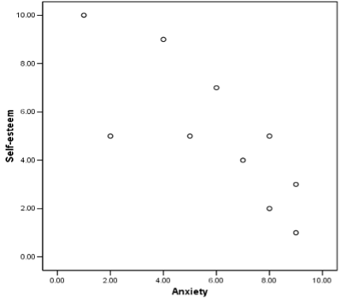

```{r setup, include=FALSE}
knitr::opts_chunk$set(echo = TRUE)
library(jmv)
```

### Introduction {.well}

The purpose of correlation and regression is to describe the relationship between two variables:

-  Correlation is the simple form of this where two variables are assessed for the degree and direction of their relationship.
-  Regression is an extension of correlation allowing for the prediction of one variable based on the scores from another.
-  The variable on the X and Y dimensions are also referred to as the predictor and the criterion variable respectively.
-  A scatterplot also highlights 3 dimensions:
     -   Type (linear, non-linear)
     -   Strength (strong, weak) is conveyed as a measure between -1 and 1
     -   Direction (positive, negative)

#### Scatterplots

<table class="table table-hover">
    <thead>
        <tr scope="row">
            <th scope="col">Person</th>
            <th scope="col">Anxiety (X)</th>
            <th scope="col">Negative mood (Y)</th>
        </tr>
    </thead>
    <tbody>
        <tr scope="row">
            <td>A</td>
            <td>5</td>
            <td>4</td>
        </tr>
        <tr scope="row">
            <td>B</td>
            <td>8</td>
            <td>6</td>
        </tr>
        <tr scope="row">
            <td>C</td>
            <td>9</td>
            <td>5</td>
        </tr>
        <tr scope="row">
            <td>D</td>
            <td>2</td>
            <td>1</td>
        </tr>
        <tr scope="row">
            <td>E</td>
            <td>7</td>
            <td>5</td>
        </tr>
        <tr scope="row">
            <td>F</td>
            <td>4</td>
            <td>3</td>
        </tr>
        <tr scope="row">
            <td>G</td>
            <td>9</td>
            <td>7</td>
        </tr>
        <tr scope="row">
            <td>H</td>
            <td>6</td>
            <td>7</td>
        </tr>
        <tr scope="row">
            <td>I</td>
            <td>1</td>
            <td>4</td>
        </tr>
        <tr scope="row">
            <td>J</td>
            <td>8</td>
            <td>7</td>
        </tr>
    </tbody>
</table>

{width=35%}
{width=35%}

#### Regression Lines

-   <abbr title="Lines of best fit">Regression lines</abbr> are used in prediction to obtain an estimate of either the corresponding X or Y value.
-   A specific formula is used to calculate the exact values.
-   This illustration of regression highlights the difference between the predictor variable and the criterion variable. When we conduct a regression analysis we would normally have a research question which asks the extent to which one variable (the predictor, X) is able to predict scores on another (the criterion, Y). To reflect this, the predictor variable is usually placed on the X axis, and the criterion is placed on the Y axis.

#### Pearson's Correlation Coefficient (r)

\begin{align}
  r = \frac{cov_{xy}}{s_xs_y} = \frac{covariance}{sd\ x\ and\ y} \\
\end{align}

#### Covariance

\begin{align}
  cov_{xy} = \frac{\Sigma(X-\bar{X})(Y-\bar{Y})}{N-1} \\
\end{align}

This formula is essentially the sum of the deviation products divided by N – 1.

### Example {.well}

-   Ten participants completed questionnaires which measured trait anxiety and negative mood. 
-   The researcher was interested in examining whether a highly trait-anxious person is more likely to report more negative mood throughout the course of a day.
-   Higher scores on both measures indicate higher trait anxiety and more negative mood.

<table class="table table-hover">
  <thead>
    <tr scope="row">
      <th scope="col" colspan="2">Scores</th>
      <th scope="col" colspan="2">Deviations<BR>from mean</th>
      <th scope="col">Products</th>
    </tr>
    <tr scope="row">
      <th scope="col">Anxiety(X)</th>
      <th scope="col">Negative<BR>mood (Y)</th>
      <th scope="col">$X - \bar{X}$</th>
      <th scope="col">$Y - \bar{Y}$</th>
      <th scope="col">$(X-\bar{X})(Y-\bar{Y})$</th>
    </tr>
  </thead>
  <tbody>
    <tr scope="row">
      <td>5</td>
      <td>4</td>
      <td>–0.9</td>
      <td>–0.9</td>
      <td>0.81</td>
    </tr>
    <tr scope="row">
        <td>8</td>
        <td>6</td>
        <td>2.1</td>
        <td>1.1</td>
        <td>2.31</td>
    </tr>
    <tr scope="row">
      <td>9</td>
      <td>5</td>
      <td>3.1</td>
      <td>0.1</td>
      <td>0.31</td>
    </tr>
    <tr scope="row">
      <td>2</td>
      <td>1</td>
      <td>–3.9</td>
      <td>–3.9</td>
      <td>15.21</td>
    </tr>
    <tr scope="row">
      <td>7</td>
      <td>5</td>
      <td>1.1</td>
      <td>0.1</td>
      <td>0.11</td>
    </tr>
    <tr scope="row">
      <td>4</td>
      <td>3</td>
      <td>–1.9</td>
      <td>–1.9</td>
      <td>3.61</td>
    </tr>
    <tr scope="row">
      <td>9</td>
      <td>7</td>
      <td>3.1</td>
      <td>2.1</td>
      <td>6.51</td>
    </tr>
    <tr scope="row">
      <td>6</td>
      <td>7</td>
      <td>0.1</td>
      <td>2.1</td>
      <td>0.21</td>
    </tr>
  </tbody>
</table>

<table class="table table-hover">
    <thead>
        <tr scope="row">
            <th scope="col">Measure</th>
            <th scope="col">Value</th>
        </tr>
    </thead>
    <tbody>
        <tr scope="row">
            <td>$\bar{X}$</td>
            <td>5.9</td>
        </tr>
        <tr scope="row">
            <td>$\bar{Y}$</td>
            <td>4.9</td>
        </tr>
        <tr scope="row">
            <td>$\Sigma(X-\bar{X})(Y-\bar{Y})$</td>
            <td>37.9</td>
        </tr>
        <tr scope="row">
            <td>$cov_{xy}$</td>
            <td>4.21</td>
        </tr>
    </tbody>
</table>

\begin{align}
  cov_{xy} &= \frac{\Sigma(X-\bar{X})(Y-\bar{Y})}{N-1} \\
  &= \frac{37.9}{9} = 4.21
\end{align}

\begin{align}
  r &= \frac{cov_{xy}}{s_xs_y} \\
  &= \frac{4.21}{2.85 \times 1.97} = 0.75
\end{align}

**Pearson’s correlation analysis reveals a strong positive relationship between anxiety and negative mood.**

>#### Reporting
>'A Pearson's correlation analysis was conducted to examine the relationship between anxiety and negative mood. The analysis revealed a significant association between the variables, *r* = .75, *N* = 10'

#### Hypothesis testing and Pearson's r

\begin{align}
H_0&: \rho = 0\ (null) \\
H_a&: \rho \ne 0\ (two-tailed) \\
H_a&: \rho < 0\ or\ \\
H_a&: \rho < 0\ (one-tailed) \\
\end{align}

#### Significance testing of $r$

Is our obtained correlation coefficient ($r$) significantly different from zero to indicate that the two variables are not independent?

\begin{align}
  t &= \frac{r\sqrt{N-2}}{{\sqrt{1-r^2}}} \\
  &= \frac{0.75\sqrt{10-2}}{{\sqrt{1-0.75^2}}} \\
  &= \frac{2.12}{0.66} = 3.21
\end{align}

>$t = 3.21(8), \alpha = 0.05$

#### Decision Making

\begin{align}
  t_{crit} &= 2.306 \\
  t_{calc} &= 3.21
\end{align}

>### Reporting
>
>'As our calculated *t*-value is greater than the critical *t*-value, we can reject the null hypothesis. The critical value of *t*  indicates that there is a significant positive relationship between anxiety and negative mood (*r* = +0.75, *n* = 10, *p* < 0.05)'

### Predicted/explained variance ($r^2$) {.well}

#### Range restriction

-   Range restriction can be detected by examining the standard deviations of variables.
-   Overly small standard deviations indicate that the variable is restricted in range (i.e. people are all scoring at a similar point on the scale).
-   Range restriction can cause an artificial change to the real correlation (either reduced or inflated).
-   For example:
      -   Overall there is a correlation between achievement test score and college GPA scores of 0.65.
      -   If we only examine the correlation between test scores and GPA for those students who score 400 or more on the test, the association reduces to 0.43.

#### Outliers

An extreme score can have a dramatic influence on the correlation coefficient.

#### Heterogeneous subsamples

-   Occurs when the data from two subgroups are mixed together. (i.e. collapsed across gender)
-   Different groups could be characterised by different correlations between the variables of interest. (agreeableness between men and women)