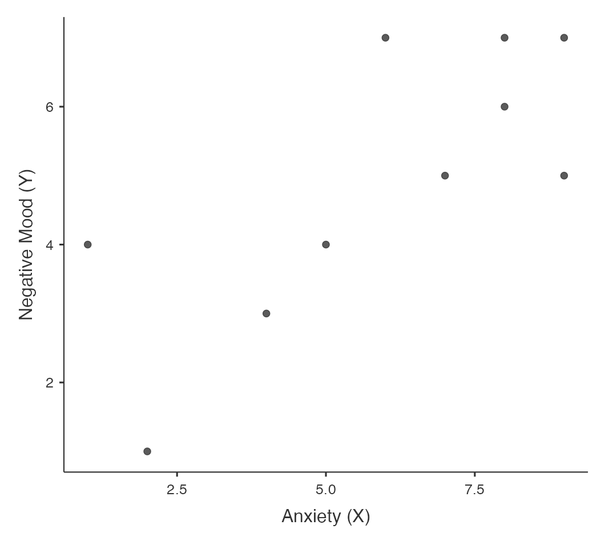

```{r setup, include=FALSE}
knitr::opts_chunk$set(echo = TRUE)
library(jmv)
```


>The purpose of correlation and regression is to describe the relationship between two variables:
>-  Correlation is the simple form of this where two variables are assessed for the degree and direction of their relationship.
>-  Regression is an extension of correlation allowing for the prediction of one variable based on the scores from another.
>-  A scatterplot of the <abbr title="observation">individual</abbr> scores for each person will 
>-  A scatterplot also highlights 3 characteristics:
>     -   Type (linear, non-linear)
>     -   Strength (strong, weak)
>     -   Direction (positive, negative)

### Example 1 {.well}

<table class="table table-hover">
    <thead>
        <tr scope="row">
            <th scope="col">Person</th>
            <th scope="col">Anxiety (X)</th>
            <th scope="col">Negative mood (Y)</th>
        </tr>
    </thead>
    <tbody>
        <tr scope="row">
            <td>A</td>
            <td>5</td>
            <td>4</td>
        </tr>
        <tr scope="row">
            <td>B</td>
            <td>8</td>
            <td>6</td>
        </tr>
        <tr scope="row">
            <td>C</td>
            <td>9</td>
            <td>5</td>
        </tr>
        <tr scope="row">
            <td>D</td>
            <td>2</td>
            <td>1</td>
        </tr>
        <tr scope="row">
            <td>E</td>
            <td>7</td>
            <td>5</td>
        </tr>
        <tr scope="row">
            <td>F</td>
            <td>4</td>
            <td>3</td>
        </tr>
        <tr scope="row">
            <td>G</td>
            <td>9</td>
            <td>7</td>
        </tr>
        <tr scope="row">
            <td>H</td>
            <td>6</td>
            <td>7</td>
        </tr>
        <tr scope="row">
            <td>I</td>
            <td>1</td>
            <td>4</td>
        </tr>
        <tr scope="row">
            <td>J</td>
            <td>8</td>
            <td>7</td>
        </tr>
    </tbody>
</table>

{width=50%}

### Example 2 {.well}

<table class="table table-hover">
  <thead>
    <tr scope="row">
      <th scope="col" colspan="2">Scores</th>
      <th scope="col" colspan="2">Deviations<BR>from mean</th>
      <th scope="col">Products</th>
    </tr>
    <tr scope="row">
      <th scope="col">Anxiety(X)</th>
      <th scope="col">Negative<BR>mood (Y)</th>
      <th scope="col">$X - \bar{X}$</th>
      <th scope="col">$Y - \bar{Y}$</th>
      <th scope="col">$(X-\bar{X})(Y-\bar{Y})$</th>
    </tr>
  </thead>
  <tbody>
    <tr scope="row">
      <td>5</td>
      <td>4</td>
      <td>–0.9</td>
      <td>–0.9</td>
      <td>0.81</td>
    </tr>
    <tr scope="row">
        <td>8</td>
        <td>6</td>
        <td>2.1</td>
        <td>1.1</td>
        <td>2.31</td>
    </tr>
    <tr scope="row">
      <td>9</td>
      <td>5</td>
      <td>3.1</td>
      <td>0.1</td>
      <td>0.31</td>
    </tr>
    <tr scope="row">
      <td>2</td>
      <td>1</td>
      <td>–3.9</td>
      <td>–3.9</td>
      <td>15.21</td>
    </tr>
    <tr scope="row">
      <td>7</td>
      <td>5</td>
      <td>1.1</td>
      <td>0.1</td>
      <td>0.11</td>
    </tr>
    <tr scope="row">
      <td>4</td>
      <td>3</td>
      <td>–1.9</td>
      <td>–1.9</td>
      <td>3.61</td>
    </tr>
    <tr scope="row">
      <td>9</td>
      <td>7</td>
      <td>3.1</td>
      <td>2.1</td>
      <td>6.51</td>
    </tr>
    <tr scope="row">
      <td>6</td>
      <td>7</td>
      <td>0.1</td>
      <td>2.1</td>
      <td>0.21</td>
    </tr>
  </tbody>
</table>

<table class="table table-hover">
    <thead>
        <tr scope="row">
            <th scope="col">Measure</th>
            <th scope="col">Value</th>
        </tr>
    </thead>
    <tbody>
        <tr scope="row">
            <td>$\bar{X}$</td>
            <td>5.9</td>
        </tr>
        <tr scope="row">
            <td>$\bar{Y}$</td>
            <td>4.9</td>
        </tr>
        <tr scope="row">
            <td>$\Sigma(X-\bar{X})(Y-\bar{Y})$</td>
            <td>37.9</td>
        </tr>
        <tr scope="row">
            <td>$cov_{xy}$</td>
            <td>4.21</td>
        </tr>
    </tbody>
</table>

{width=50%}

>### Reporting
>'A Pearson's correlation analysis was conducted to examine the relationship between X and Y. The analysis revealed a significant association between the variables, *r* = .59, *N* = 10'
