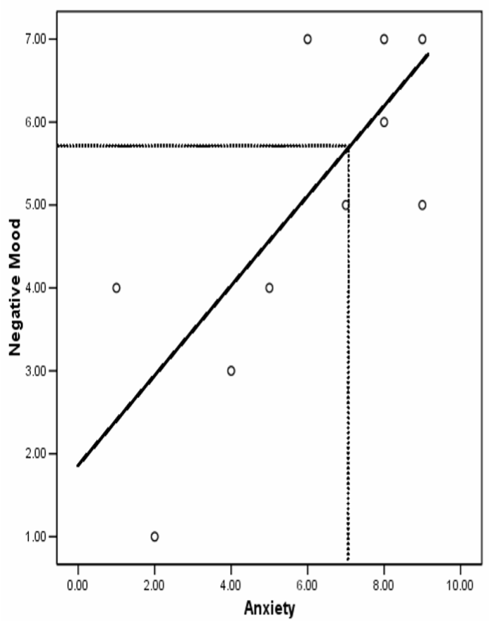
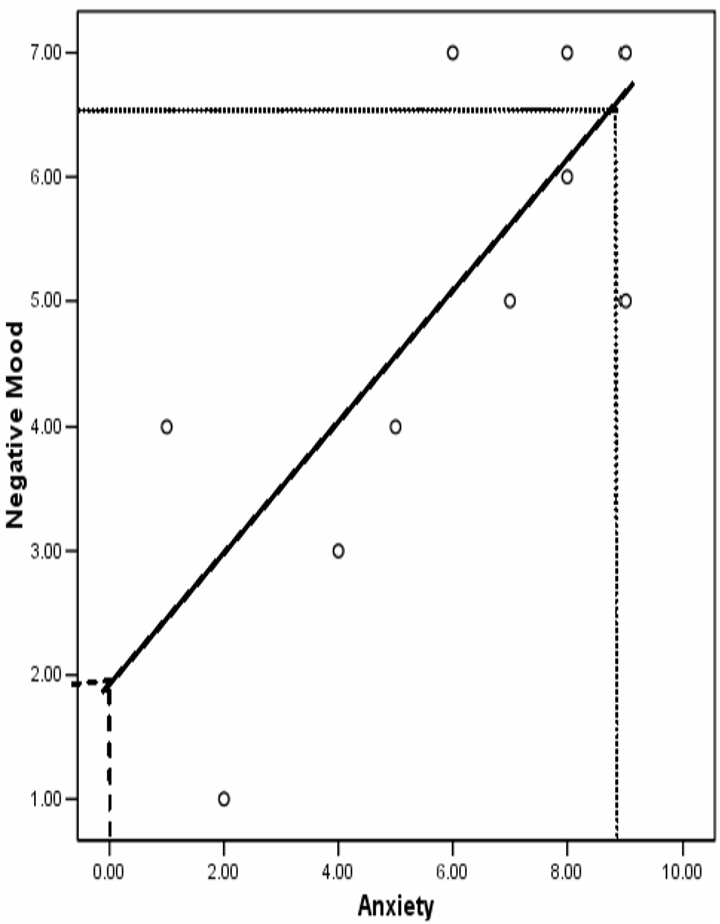

```{r setup, include=FALSE}
knitr::opts_chunk$set(echo = TRUE)
library(jmv)
```

### Introduction {.well}

-   Using the regression line (line of best fit), we can predict negative mood scores (Y / DV / criterion) based on anxiety (X / IV / predictor).
-   In a bivariate analysis we can predict Y for any given value of X statistically, via the use of the intercept (a) and slope (b).
-   A multiple analysis looks at the impact of the IV on several DVs
-   We can estimate the value of Y from X via the scatterplot as below:

{width=50%}

### Components {.well}

#### Slope

The slope describes the degree of difference (rise) in our Y prediction where the value of X increases by 1.

\begin{align}
  b &= \frac{cov_{XY}}{s_X^2}
\end{align}

#### Intercept

The intercept predicts the point at which our line of regression crosses the Y axis.

\begin{align}
  a &= \bar{Y} - b\bar{X}
\end{align}

#### Equation

We use the below formula with a low and high point for X to statistically estimate the respective values of Y.

\begin{align}
  \hat{Y} = bX + a
\end{align}

#### Standard Error of estimate

This value gives us the mean (?) distance between our plotted values and the regression line.

\begin{align}
  S_{Y.X} = S_Y\sqrt{(1-r^2)}
\end{align}

#### Confidence Limits (95%)

\begin{align}
  CI_Y = \hat{Y} \pm (t_{a/2})(S_{Y.X})
\end{align}

### Anxiety vs Negative Mood Example {.well}

#### Data

<table class="table table-hover">
  <thead>
    <tr scope="row">
      <th scope="col" colspan="2">Scores</th>
      <th scope="col" colspan="2">Deviations<BR>from mean</th>
      <th scope="col">Products</th>
    </tr>
    <tr scope="row">
      <th scope="col">Anxiety (*X*)</th>
      <th scope="col">Negative<BR>mood (*Y*)</th>
      <th scope="col">$X - \bar{X}$</th>
      <th scope="col">$Y - \bar{Y}$</th>
      <th scope="col">$(X-\bar{X})(Y-\bar{Y})$</th>
    </tr>
  </thead>
  <tbody>
    <tr scope="row">
      <td>5</td>
      <td>4</td>
      <td>–0.9</td>
      <td>–0.9</td>
      <td>0.81</td>
    </tr>
    <tr scope="row">
        <td>8</td>
        <td>6</td>
        <td>2.1</td>
        <td>1.1</td>
        <td>2.31</td>
    </tr>
    <tr scope="row">
      <td>9</td>
      <td>5</td>
      <td>3.1</td>
      <td>0.1</td>
      <td>0.31</td>
    </tr>
    <tr scope="row">
      <td>2</td>
      <td>1</td>
      <td>–3.9</td>
      <td>–3.9</td>
      <td>15.21</td>
    </tr>
    <tr scope="row">
      <td>7</td>
      <td>5</td>
      <td>1.1</td>
      <td>0.1</td>
      <td>0.11</td>
    </tr>
    <tr scope="row">
      <td>4</td>
      <td>3</td>
      <td>–1.9</td>
      <td>–1.9</td>
      <td>3.61</td>
    </tr>
    <tr scope="row">
      <td>9</td>
      <td>7</td>
      <td>3.1</td>
      <td>2.1</td>
      <td>6.51</td>
    </tr>
    <tr scope="row">
      <td>6</td>
      <td>7</td>
      <td>0.1</td>
      <td>2.1</td>
      <td>0.21</td>
    </tr>
  </tbody>
</table>

<table class="table table-hover">
    <thead>
        <tr scope="row">
            <th scope="col">Measure</th>
            <th scope="col">Value</th>
        </tr>
    </thead>
    <tbody>
        <tr scope="row">
            <td>$\bar{X}$</td>
            <td>5.9</td>
        </tr>
        <tr scope="row">
            <td>$SD_X$</td>
            <td>2.85</td>
        </tr>
        <tr scope="row">
            <td>$\bar{Y}$</td>
            <td>4.9</td>
        </tr>
        </tr>
        <tr scope="row">
            <td>$SD_Y$</td>
            <td>1.97</td>
        </tr>
        <tr scope="row">
            <td>$\Sigma(X-\bar{X})(Y-\bar{Y})$</td>
            <td>37.9</td>
        </tr>
        <tr scope="row">
            <td><abbr title="$\frac{\Sigma(X-\bar{X})(Y-\bar{Y})}{N-1}$">$cov_{xy}$<\abbr></td>
            <td>4.21</td>
        </tr>
    </tbody>
</table>

#### Steps: {.tabset}

##### Calculate Slope

\begin{align}
  b &= \frac{cov_{XY}}{s_X^2} \\
  &= \frac{4.21}{2.85^2} \\
  &= 0.52
\end{align}

##### Calculate Intercept

\begin{align}
  a &= \bar{Y} - b\bar{X} \\
  &= 4.9 - (0.52 \times 5.9) \\
  &= 1.83
\end{align}

##### Calculate/Plot Regression Line

Where $X = 0$:

\begin{align}
  \hat{Y} &= bX + a \\
  &= (0.52 \times 0) + 1.83 \\
  &= 1.83
\end{align}

Where $X = 9$:

\begin{align}
  \hat{Y} &= bX + a \\
  &= (0.52 \times 9) + 1.83 \\
  &= 6.51
\end{align}

We now simply plot this line on the graph so that it passes through the points (X = 0, Y = 1.832) and (X = 9, Y = 6.512).

{width=50%}

##### Calculate SEOE

\begin{align}
  S_{Y.X} &= S_Y\sqrt{(1-r^2)} \\
  &= 1.97\sqrt{(1-0.56)} \\
  &= 1.97\sqrt{0.44} \\
  &= 1.97 \times 0.66 \\
  &= 1.31
\end{align}

##### Confidence Limits {-}

The critical value of *t*($\alpha$ = 0.05, df = 8) is 2.306.

Where $X = 6$:

\begin{align}
  \hat{Y} &= bX + a \\
  &= (0.52 \times 6) + 1.83 \\
  &= 3.18 + 1.83 \\
  &= 5.01 \\
  \\
  CI_Y &= \hat{Y} \pm (t_{a/2})(S_{Y.X}) \\
  &= 5.01 \pm (2.306 \times 1.31) \\
  &= 5.01 \pm 3.021 \\
  &= 1.989\ to\ 8.031
\end{align}
